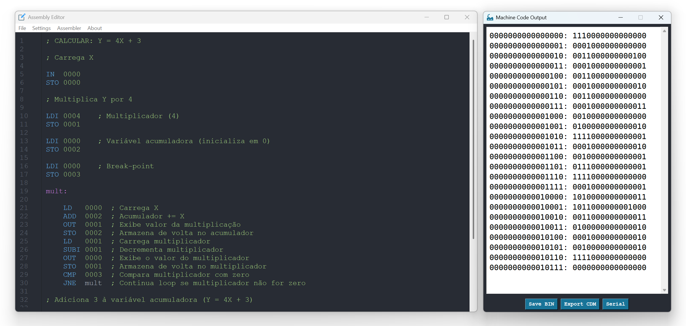
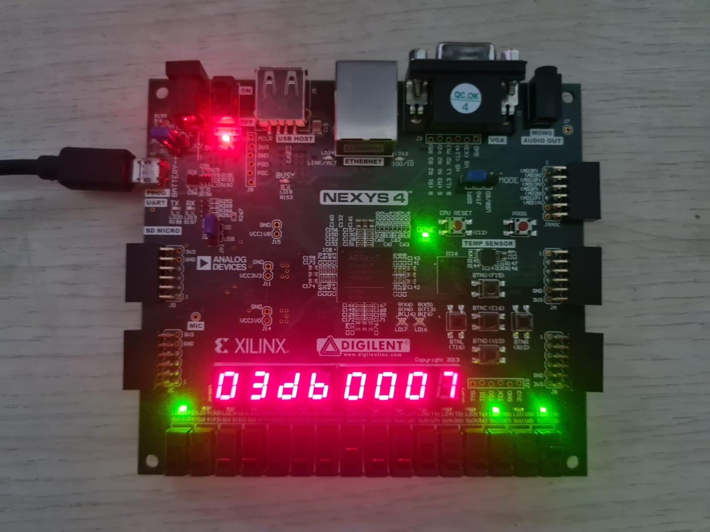

# 🖥️ BIP-ACE (Assembly Coding Environment)

[](https://www.microsoft.com)
[](https://python.org)

  
*Interface do BIP-ACE em Dark Mode*

**Ferramenta definitiva para aprendizado de Assembly**  
Desenvolvido para ensino de Arquitetura e Organização de Computadores

## ✨ Funcionalidades Principais

### Editor Inteligente
- Realce sintático configurável por ISA
- Multiplos temas (Dark/Light Mode)
- Suporte a labels (etiquetas) e comentários

### Montagem Flexível
- Suporte a múltiplas arquiteturas via JSON
- Exportação para formatos:
  - `.bin` (Binário puro)
  - `.cdm` (CEDAR Memory File)
- Validação de sintaxe

## 🔌 Integração com BIP-FPGA

  
*Foto da Nexys 4 com BIP-FPGA*

- Programação via Serial/UART integrada

### Fluxo de Trabalho
1. Escreva o código Assembly no BIP-ACE
2. Monte o código de máquina
3. Conecte via USB na Nexys 4
4. Transmita o programa via Serial (UART - 9600 bps)

### Conjunto de Instruções (ISA BIP-I)

| OP CODE | BINARY | INSTRUCTION | DESCRIPTION | 
|:-------:|:------:|:-----------:|-------------|
| 0 | 0000 | **HLT** | Halt |
| 1 | 0001 | **STO** | (addr) ← ACC |
| 2 | 0010 | **LD** | ACC ← (addr) |
| 3 | 0011 | **LDI** | ACC ← const. |
| 4 | 0100 | **ADD** | ACC ← ACC + (addr) |
| 5 | 0101 | **ADDI** | ACC ← ACC + const. |
| 6 | 0110 | **SUB** | ACC ← ACC - (addr) |
| 7 | 0111 | **SUBI** | ACC ← ACC - const. |
| 8 | 1000 | **JUMP** | PC ← const. |
| 9 | 1001 | **NOP** | No operation | 
| A | 1010 | **CMP** | Compare ACC with (addr) |
| B | 1011 | **JNE** | PC ← const., if CMP ≠ ACC |
| C | 1100 | **JL** | PC ← const., if CMP < ACC |
| D | 1101 | **JG** | PC ← const., if CMP > ACC | 
| E | 1110 | **IN** | ACC ← INPUT(addr) | 
| F | 1111 | **OUT** | OUTPUT(addr) ← ACC |

### Mais informações

- Placa: Digilent Nexys 4 (Artix-7 XC7A100T)
- A arquitetura foi validada via GHDL no repositório [BIP-I](https://github.com/Nyfeu/BIP-I)
- **Documentação:** Um manual detalhado sobre o software e sua arquitetura está disponível em [BIP_ACE.pdf](BIP_ACE.pdf).

## 📦 Instalação

### Para Usuários
1. Baixe a última versão em [Releases](https://github.com/Nyfeu/BIP-ACE/releases).
2. Extraia o ZIP contendo:
```
ZIP
├── BIP-ACE.exe
├── /configs
├── /examples
└── /assets
```
3. Execute "BIP-ACE.exe"

## 📚 Exemplos
Explore a pasta /examples:
- `fib_out.asm` - cálculo da sequência de Fibonacci
- `expression.asm` - cálculo de expressão algébrica simples
